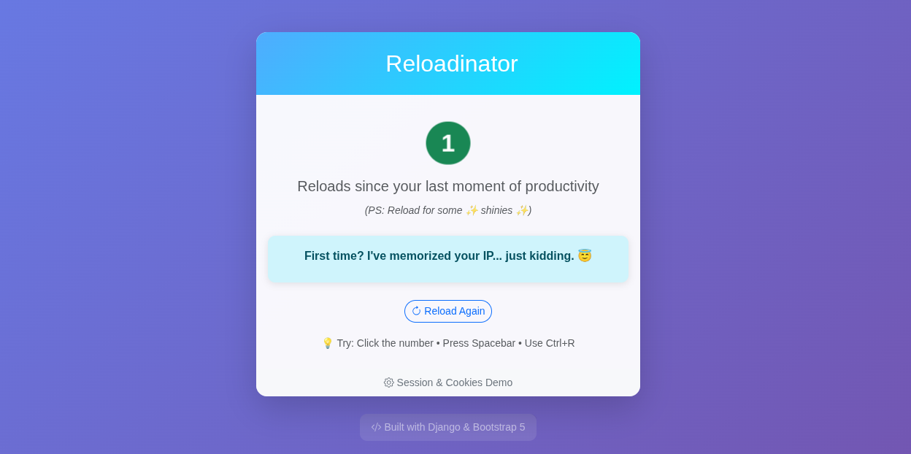

# Reloadinator

[Reloadinator](https://reloadinator.pythonanywhere.com/) is a sassy web
application that judges you everytime you reload the page. It's a fun example
to show how cookies and sessions work in Django.

## How to Play

1. Open the page in your browser
2. Reload the page as many times as you want
3. Watch the fun and silly interactions happen

> Did you find the Easter egg? 😉

## Features

- Cookie and session management
- Fun interactions and animations
- Random background color change on long idle
- Easter egg!
- Keyboard shortcuts
- Animated reload button

## Installation

### Locally in a virtualenv

1. Clone the repository
2. create a virtual environment and activate it
3. Install the dependencies with `pip install -r requirements.txt`
4. Run the development server with `python manage.py runserver`
5. Open http://localhost:8000 in your browser

### Docker

1. Clone the repository
2. Edit `.env.dist` and rename to `.env`
3. Build the Docker image with `docker build -t reloadinator .`
4. Run the Docker container with `docker run -p 8000:8000 reloadinator`
5. Open http://localhost:8000 in your browser

## License

This project is licensed under the MIT License - see the [LICENSE](LICENSE) file for details.
